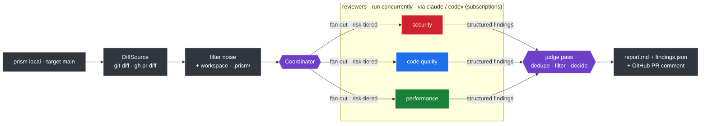

# Prism

<p align="center">
  
</p>

<p align="center">
  
  
  
  
  
</p>

**AI code review orchestration that runs on your Claude/Codex subscriptions — not per-token API billing.**

Prism splits a diff into specialized reviewer "wavelengths" (security, code quality, …),
runs them concurrently, and recombines their findings through a coordinator that
deduplicates, filters false positives, and produces one structured verdict. It's modeled
on [Cloudflare's AI code review architecture](https://blog.cloudflare.com/ai-code-review/),
adapted to drive the `claude` and `codex` CLIs so reviews run on subscriptions you
already pay for.

> [!NOTE]
> **Working MVP.** `prism local` reviews a diff end-to-end on your subscriptions, in
> Docker or locally, and posts to a GitHub PR. It even reviews its own repo — Prism caught
> real issues in its own Docker wrapper during development. Roadmap and remaining work live
> in [GitHub Issues](https://github.com/joshuafuller/prism/issues) and the
> [implementation plan](docs/superpowers/plans/2026-05-29-prism-mvp.md).

## Why it exists

Naive "shove a git diff into a prompt and ask for bugs" produces noise — hallucinated
errors and "consider adding error handling" on code that already has it. Prism instead
uses **specialized reviewers with explicit "what NOT to flag" boundaries**, a **judge
pass**, and **structured findings**, biased hard toward signal over noise.

## How it works



- **Engine** is the single LLM chokepoint. Default engines shell out to the subscription
  CLIs; API-key engines are an opt-in fallback. Model versions are never hardcoded — the
  CLI uses your subscription's current model (Opus 4.8 today).
- **Reasoning effort** is a per-reviewer knob (cheap reviewers run low, the coordinator
  runs high) — on a subscription, tokens are your rate-limit budget.
- **Reviewer prompts are markdown** (`src/prism/agents/*.md` + a shared rules file). Add
  or tune a reviewer by editing markdown — no core code change.

See the [design spec](docs/superpowers/specs/2026-05-29-prism-mvp-design.md), the
[architecture decisions](docs/adr/), and the
[lessons we built on](docs/reference/cloudflare-lessons.md).

## Requirements

> [!IMPORTANT]
> Prism does not ship a model. It drives CLIs you authenticate with your **own**
> subscriptions — without a logged-in `claude` and/or `codex` CLI, it has nothing to run.

- A **Claude subscription** (e.g. Max) with the [`claude` CLI](https://docs.anthropic.com/en/docs/claude-code)
  logged in, and/or a **ChatGPT/Codex subscription** with the `codex` CLI. (API keys work
  as an opt-in fallback, but the point is to avoid per-token billing.)
- [`gh`](https://cli.github.com/) (or `glab` for GitLab) authenticated, to post to a PR/MR.
- **Docker** (recommended) — or Python 3.12 + [uv](https://docs.astral.sh/uv/) to run on the host.

## Quickstart

> [!TIP]
> Use the Docker path — it bundles the `claude`, `codex`, and `gh` CLIs, so you need
> nothing on your host but Docker and your existing logins.

```bash
cp prism.example.yaml prism.yaml     # configure once (see the Usage Guide)
docker build -t prism .              # build the image (once)
bin/prism local --target main        # review the current branch against main
```

Prism writes the verdict to two files:

- **`.prism/report.md`** — the human-readable review (like the [example](#example-review) below)
- **`.prism/findings.json`** — the same findings as structured JSON, for CI and AI agents

Add `--post-pr 42` (GitHub) or `--post-mr 77` (GitLab) to post the summary to a review
thread. The exit code is nonzero only when the verdict reaches your `policy.fail_on`, so
`prism local` drops straight into CI.

> [!NOTE]
> **Read these next.** The README is an overview; the real how-to lives here:
> - **[Usage Guide](docs/usage.md)** — configuration, the review workflow, reading the
>   output, CI, and posting to PRs/MRs.
> - **[Using Prism with AI Agents](docs/ai-agents.md)** — wire Prism in as a self-review
>   gate for Claude Code, Cursor, or Codex.

### Example review

An illustrative review (the diff is fictional; the structure is what Prism produces).
Independent reviewers each flag their own domain, the verdict blocks on the critical
finding, and the coordinator drops a nitpick:

> ### Prism review: `significant_concerns`
>
> This change adds a public order-search endpoint. The security reviewer found a
> SQL-injection vector reachable without authentication — that blocks merge. Performance
> flagged an N+1 query that will degrade under load. A code-quality note about naming was
> dropped as not worth flagging.
>
> **Critical (1)**
>
> - **SQL injection in order search** — `api/orders.py:42` _(security, high confidence)_
>   - The handler formats the user-supplied `q` straight into the query (`... WHERE name LIKE '%{q}%'`). A value like `%' OR '1'='1` returns every row, and the route has no auth check, so anyone can reach it.
>   - **Fix:** use a parameterized query — `cursor.execute(sql, (f"%{q}%",))` — and never interpolate user input into SQL.
>
> **Warning (1)**
>
> - **N+1 query loads each customer in a loop** — `api/orders.py:55` _(performance, medium confidence)_
>   - For every order in the page the handler issues a separate `Customer.get(id)` query, so a 200-row response fires 201 queries. Fine in dev; falls over under load.
>   - **Fix:** load customers in one `IN (...)` query (or eager-load the relation) and map them in memory.
>
> ---
>
> _Prism is an AI first-pass, **not a replacement for human review** — it can miss architectural intent, cross-system impact, and subtle concurrency bugs._

Prism also dogfoods on itself — during development it caught real bugs in its own code,
including one in the change that added the example transcripts.

## Add your own reviewer

Reviewers are markdown, not code (ADR-0009):

1. Write `src/prism/agents/<name>.md` with `## What to Flag` / `## What NOT to Flag`
   sections (copy an existing one like `security.md`).
2. Add it to `prism.yaml` under `reviewers:` with an `engine` and `effort`.

That's it — no core code change. The shipped set is `security`, `code_quality`, and
`performance`, plus optional `documentation` and `release` reviewers you can enable.

## Developing

Python 3.12, managed entirely with [uv](https://docs.astral.sh/uv/) — no pip, no manual venvs.

```bash
uv sync --dev          # set up the environment
uv run pytest          # fast unit suite (LLMs are faked; no network, no cost)
uv run pytest -m live  # opt-in: exercises the real subscription CLIs
uv run ruff check .    # lint
uv run mypy src        # types
```

A **pre-commit lint hook is enforced** (`git config core.hooksPath .githooks`) and a
pre-push hook runs the full gate locally. The GitHub Actions workflow runs ruff, mypy,
pytest, and semgrep; its `push`/`pull_request` triggers are enabled once the repo is
public (free Actions). Quality gates fail fast.

## Roadmap & contributing

Planned work, known issues, and the roadmap live in
[GitHub Issues](https://github.com/joshuafuller/prism/issues). Bug reports, ideas, and new
reviewer prompts are welcome. The design rationale is in the
[spec](docs/superpowers/specs/2026-05-29-prism-mvp-design.md) and
[ADRs](docs/adr/).

## Limitations

> [!CAUTION]
> Prism is **not** a replacement for human review. Like all AI reviewers it is weak at
> architectural intent ("why was this designed this way"), cross-system impact (it can
> flag an API-contract change but can't verify every consumer was updated), and subtle
> concurrency/race bugs that don't show up in a static diff.

Treat it as a fast first pass that catches real bugs and clears clean code — not a gate
you stop thinking behind.

## License

[Apache License 2.0](LICENSE) — permissive, with an explicit patent grant. Use it,
modify it, embed it; just keep the notice. See [`NOTICE`](NOTICE).
