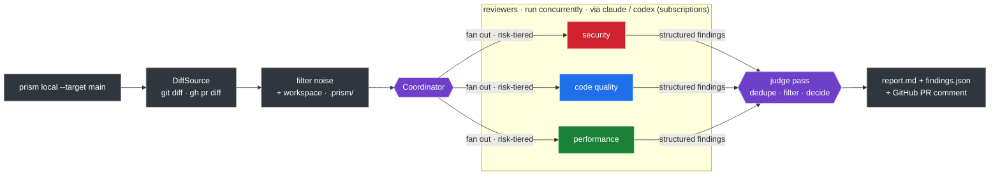

# Prism

<p align="center">
  
</p>

<p align="center">
  
  
  
  
  
</p>

**AI code review orchestration that runs on your Claude/Codex subscriptions — not per-token API billing.**

Prism splits a diff into specialized reviewer "wavelengths" (security, code quality, …),
runs them concurrently, and recombines their findings through a coordinator that
deduplicates, filters false positives, and produces one structured verdict. It's modeled
on [Cloudflare's AI code review architecture](https://blog.cloudflare.com/ai-code-review/),
adapted to drive the `claude` and `codex` CLIs, so reviews run on subscriptions you
already pay for rather than metered per-token API billing.

> **Status: working MVP.** `prism local` reviews a diff end-to-end on your subscriptions,
> in Docker or locally, and posts to a GitHub PR. It even reviews its own repo — Prism
> caught real issues in its own Docker wrapper during development. Roadmap and remaining
> work live in [beads](#work-tracking) and the
> [implementation plan](docs/superpowers/plans/2026-05-29-prism-mvp.md).

## Why it exists

Naive "shove a git diff into a prompt and ask for bugs" produces noise — hallucinated
errors and "consider adding error handling" on code that already has it. Prism instead
uses **specialized reviewers with explicit "what NOT to flag" boundaries**, a **judge
pass**, and **structured findings**, biased hard toward signal over noise.

## How it works



- **Engine** is the single LLM chokepoint. Default engines shell out to the subscription
  CLIs; API-key engines are an opt-in fallback. Model versions are never hardcoded — the
  CLI uses your subscription's current model (Opus 4.8 today).
- **Reasoning effort** is a per-reviewer knob (cheap reviewers run low, the coordinator
  runs high) — on a subscription, tokens are your rate-limit budget.
- **Reviewer prompts are markdown** (`agents/*.md` + a shared rules file). Add or tune a
  reviewer by editing markdown — no core code change.

See the [design spec](docs/superpowers/specs/2026-05-29-prism-mvp-design.md), the
[architecture decisions](docs/adr/), and the
[lessons we built on](docs/reference/cloudflare-lessons.md).

## Running it

Add a `prism.yaml` to your repo (copy `prism.example.yaml`), then:

**In Docker (recommended — no host Python needed):**

```bash
docker build -t prism .                 # once (use --build-arg APP_UID="$(id -u)" if your uid != 1000)
bin/prism local --target main           # review your branch vs main → report.md
bin/prism local --target main --post-pr 42   # also post a summary to GitHub PR #42
bin/prism local --target main --post-mr 77   # …or to GitLab MR !77 (via glab)
```

`bin/prism` mounts your repo and a **throwaway copy** of your `~/.claude` / `~/.codex` /
`~/.config/gh` credentials, so the CLIs authenticate with your existing logins while your
real host credentials stay untouched (a prompt-injected reviewer can't tamper with them).
Subscriptions work inside the container with **no API key in the environment** (ADR-0002).

**Locally (if you have the CLIs + uv on the host):**

```bash
uv run prism local --target main --config prism.example.yaml
```

Exit code is nonzero only when the decision matches your `policy.fail_on`
(default `significant_concerns`), so it drops cleanly into CI.

## Add your own reviewer

Reviewers are markdown, not code (ADR-0009):

1. Write `agents/<name>.md` with `## What to Flag` / `## What NOT to Flag` sections.
2. Add it to `prism.yaml` under `reviewers:` with an `engine` and `effort`.

That's it — no core code change.

## Developing

Python 3.12, managed entirely with [uv](https://docs.astral.sh/uv/) — no pip, no manual venvs.

```bash
uv sync --dev          # set up the environment
uv run pytest          # fast unit suite (LLMs are faked; no network, no cost)
uv run pytest -m live  # opt-in: exercises the real subscription CLIs
uv run ruff check .    # lint
uv run mypy src        # types
```

A **pre-commit lint hook is enforced** (`git config core.hooksPath .githooks`); CI runs
ruff, mypy, pytest, and semgrep. Quality gates fail fast.

## Work tracking

All work — past, present, future — is tracked in [beads](https://github.com/gastownhall/beads) (`bd`):

```bash
bd ready    # what's workable now
bd list     # open issues
bd show <id>
```

## Limitations (honest)

Prism is **not** a replacement for human review. Like all AI reviewers it is weak at:
architectural intent ("why was this designed this way"), cross-system impact (it can flag
an API-contract change but can't verify every consumer was updated), and subtle
concurrency/race bugs that don't show up in a static diff. Treat it as a fast first pass
that catches real bugs and clears clean code — not a gate you stop thinking behind.

## License

TBD.
